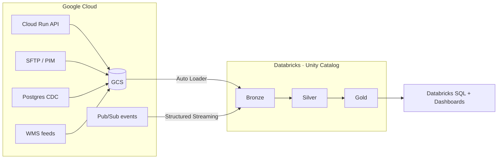

# Enterprise E-Commerce Lakehouse & Real-Time Analytics Platform

**GCP + Databricks · Delta Lake · Unity Catalog · Medallion Architecture**

> 🚧 **Work in progress.** Phase 1 (architecture and design) complete. Implementation begins at
> Phase 2. The full README — with screenshots, setup instructions and results — is a Phase 15
> deliverable.

---

## What this is

A production-style lakehouse for a fictional US e-commerce retailer, built on **Databricks Free
Edition** with **Google Cloud** source systems. It ingests from five heterogeneous sources through
a config-driven framework, applies CDC and slowly-changing-dimension history, enforces data quality
with quarantine and reconciliation, serves a conformed star schema, and runs a parallel streaming
path for real-time metrics.

It is deliberately not a `CSV → notebook → chart` project.

## Current status

| Phase | Deliverable | Status |
|---|---|---|
| 0 | Feasibility, constraints, cost model | ✅ [PHASE0-FEASIBILITY.md](docs/PHASE0-FEASIBILITY.md) |
| 1 | Architecture and design | ✅ see below |
| 2 | Environment setup + spikes | ⏭️ next |
| 3–15 | Implementation | ⬜ |

## Phase 1 documents

| Document | Contents |
|---|---|
| [BUSINESS_REQUIREMENTS.md](docs/BUSINESS_REQUIREMENTS.md) | Business scenario, stakeholders, 13 business questions, agreed metric definitions, functional requirements |
| [ARCHITECTURE.md](docs/ARCHITECTURE.md) | Six Mermaid diagrams, nine architecture decision records, GCP→Databricks concept mapping *including where it breaks down* |
| [DATA_MODEL.md](docs/DATA_MODEL.md) | Source contracts, injected defect catalogue, Silver design, star schema ER diagram, fact grain, key strategy |
| [NON_FUNCTIONAL_REQUIREMENTS.md](docs/NON_FUNCTIONAL_REQUIREMENTS.md) | Freshness, idempotency contract, reliability, DQ thresholds, reconciliation, performance, scale-out analysis |
| [SECURITY.md](docs/SECURITY.md) | PII classification, role model, masking, secrets, identity flow to cloud storage |
| [COST.md](docs/COST.md) | $0 budget model, ranked cost traps, quota management |
| [REPO_STRUCTURE.md](docs/REPO_STRUCTURE.md) | Repository layout, deviations and rationale, branching model |

## Architecture

## Honesty notes

This project runs on a free tier. Where a capability is unavailable, it is **simulated and
labelled**, never hand-waved:

- **Kafka** → Pub/Sub, because Free Edition restricts outbound networking. Streaming semantics are
  identical; the production Kafka configuration is documented.
- **DEV/TEST/PROD** → three Unity Catalog catalogs in one workspace, because Free Edition permits
  one workspace.
- **Multi-user RBAC** → real groups and service principals, but only one human identity exists.
- **All data is synthetic.** No production deployment is claimed.

## Tech stack

Databricks (Unity Catalog, Delta Lake, Auto Loader, Structured Streaming, Lakeflow Jobs, Databricks
SQL) · Google Cloud (GCS, Pub/Sub, Cloud Run, Secret Manager, Compute Engine) · PySpark · Python ·
SQL · Terraform · Databricks Asset Bundles · GitHub Actions · pytest
