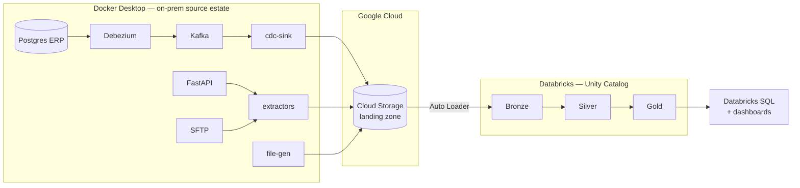

# Enterprise E-Commerce Lakehouse on Databricks

**Batch Lakehouse · Google Cloud + Databricks · Delta Lake · Unity Catalog · Debezium CDC**

> 🚧 **Work in progress.** Phase 1 (architecture and design) complete at revision **R2**.
> Implementation begins at Phase 2. The full README — screenshots, setup, results — is a Phase 15
> deliverable.

---

## What this is

A production-style **batch** lakehouse for a fictional US e-commerce retailer. Five operational
source systems run as containers on Docker Desktop, standing in for an on-premise estate. They land
files into Google Cloud Storage, which Databricks ingests with Auto Loader into a governed
Bronze → Silver → Gold model, served through Databricks SQL.

Deliberately not a `CSV → notebook → chart` project.

## Current status

| Phase | Deliverable | Status |
|---|---|---|
| 0 | Feasibility, constraints, cost model | ✅ [PHASE0-FEASIBILITY.md](docs/PHASE0-FEASIBILITY.md) |
| 1 | Architecture and design (R2) | ✅ see below |
| 2 | Docker estate, GCP setup, Databricks setup, spikes | ⏭️ next |
| 3–15 | Implementation | ⬜ |

## Design documents

| Document | Contents |
|---|---|
| [BUSINESS_REQUIREMENTS.md](docs/BUSINESS_REQUIREMENTS.md) | Business scenario, stakeholders, 13 business questions, agreed metric definitions, functional requirements |
| [ARCHITECTURE.md](docs/ARCHITECTURE.md) | 7 Mermaid diagrams, 10 architecture decision records, the Docker source estate, GCP→Databricks concept mapping *including where it breaks down* |
| [DATA_MODEL.md](docs/DATA_MODEL.md) | Source contracts, Debezium envelope, injected defect catalogue, Silver design, star schema, fact grain, key strategy |
| [NON_FUNCTIONAL_REQUIREMENTS.md](docs/NON_FUNCTIONAL_REQUIREMENTS.md) | Freshness, idempotency contract, DQ thresholds, reconciliation, local-execution requirements, scale-out analysis |
| [SECURITY.md](docs/SECURITY.md) | PII classification, role model, masking, secrets, identity flow to cloud storage |
| [COST.md](docs/COST.md) | $0 budget model, ranked cost traps, local resource budget, quota management |
| [REPO_STRUCTURE.md](docs/REPO_STRUCTURE.md) | Repository layout, deviations and rationale, branching model |

## What makes this different

Every transformation **actually executes**. A `spark-dev` container gives a real JDK and a real
Spark runtime, so the full Bronze → Silver → Gold pipeline runs and is tested locally against real
data before it reaches Databricks — and most development consumes no Databricks quota at all.

CDC is **real**, not simulated: Debezium captures the Postgres write-ahead log, changes flow through
Kafka, and Silver orders them by log sequence number rather than by an unreliable application
timestamp.

## Scope

**Batch only.** No streaming path. Auto Loader runs on the Structured Streaming engine in
incremental-batch mode (`Trigger.AvailableNow`) — checkpointing, exactly-once file processing and
schema evolution are all in scope; watermarks, event-time windows and sub-minute SLAs are not.

## Honesty notes

Where a capability is unavailable, it is **labelled**, never hand-waved:

- **DEV/TEST/PROD** → three Unity Catalog catalogs in one workspace, because Free Edition permits
  one workspace.
- **Multi-user RBAC** → real groups and service principals, but only one human identity exists.
- **On-premise SQL Server** → Docker Postgres with genuine Debezium WAL capture. The CDC is real;
  only the choice of RDBMS is a stand-in.
- **All data is synthetic.** No production deployment is claimed.

## Tech stack

Databricks (Unity Catalog, Delta Lake, Auto Loader, Lakeflow Jobs, Databricks SQL, Asset Bundles) ·
Google Cloud (Cloud Storage, Secret Manager) · Docker (Postgres, Debezium, Kafka, FastAPI, SFTP,
Spark) · PySpark · Python · SQL · Terraform · GitHub Actions · pytest

## Related work

Sibling projects in this portfolio, deliberately non-overlapping:

- **`real-time-analytics-on-gcp`** — streaming platform on GCP
- **`supply-chain-batch-platform`** — batch platform on GCP with Iceberg, BigQuery and Airflow

This project covers what those do not: Delta Lake, Unity Catalog governance, Lakeflow Jobs, Asset
Bundles, and Debezium-based CDC.
