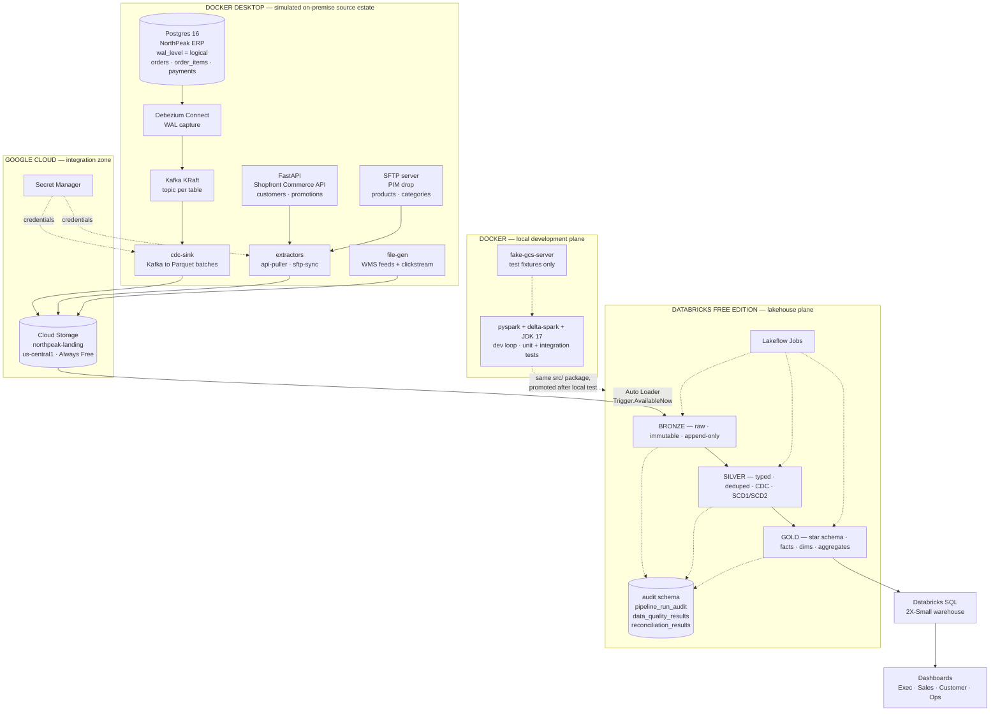
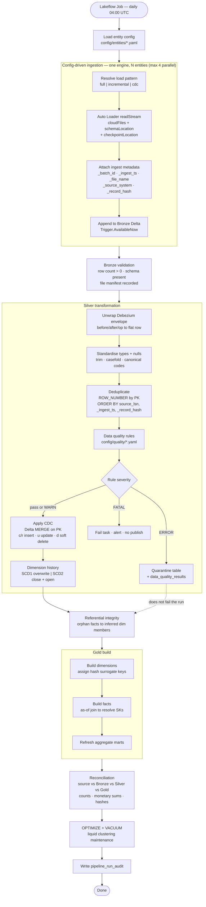
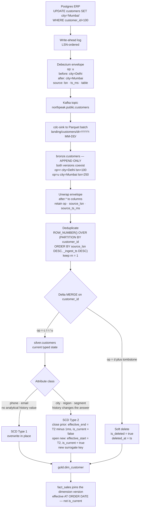
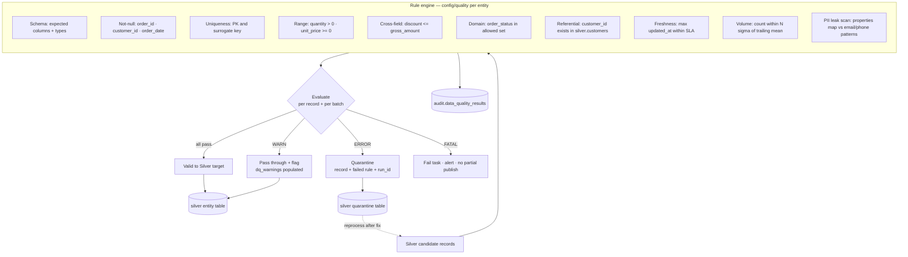
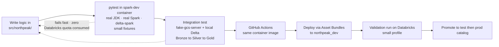
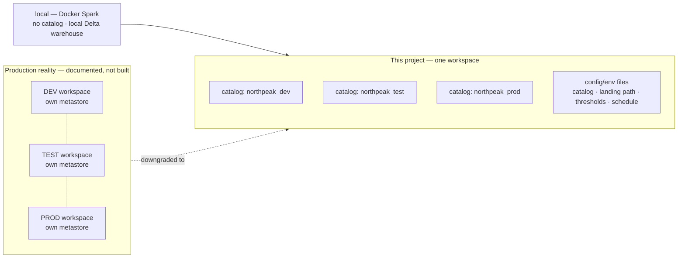

# Architecture

**Project:** Enterprise E-Commerce Lakehouse (GCP + Databricks) — **batch only**
**Phase:** 1 — design only
**Revision:** R2 — scope narrowed to batch; local Docker source estate introduced

**Constraints assumed:** Databricks Free Edition (serverless, one workspace, no GCP Organization),
personal GCP project on the $300 / 90-day trial and Always Free tier, and **Docker Desktop on a
16 GB Windows machine** (≈8 GB reaching containers under default WSL2 settings).

---

## 1. What changed in R2, and why

Two decisions reshaped this architecture: **batch only**, and **Docker Desktop is available**.

### Batch only

The streaming path, Pub/Sub, watermarking, event-time windowing and the `rt_*` real-time marts are
**removed**. This is a sound call in context — your portfolio already contains
`real-time-analytics-on-gcp`, so streaming is demonstrated elsewhere and repeating it here adds
little.

What is *not* lost, and should be stated carefully in interviews: **Auto Loader is the Structured
Streaming engine running in incremental-batch mode.** With `Trigger.AvailableNow` you still get
checkpointing, exactly-once file processing, schema inference and evolution, and stateful progress
tracking. The honest claim is *"incremental batch ingestion built on the Structured Streaming
engine"* — not *"streaming pipeline"*. Genuinely lost: watermarks, event-time windows,
`dropDuplicatesWithinWatermark`, and sub-minute SLAs.

### Docker changes the source estate

Previously the source systems ran on GCP compute (Cloud Run, `e2-micro`). Now they run locally in
Docker. This is not a downgrade — it is a **more realistic enterprise topology**:

> On-premise operational systems → cloud object storage landing zone → cloud lakehouse.
>
> That hybrid pattern is the most common enterprise data architecture there is, and far more
> representative than "everything already lives in one cloud".

It also removes all GCP compute from the critical path, hardening the cost story to $0, and — most
importantly — it gives you a **real Spark runtime with a real JDK locally**.

---

## 2. Differentiation from your existing portfolio

Your `supply-chain-batch-platform` is a completed GCP batch medallion platform with Docker-based
sources, Airflow, Iceberg, SCD1/SCD2, a star schema and Terraform. Without deliberate separation,
this project risks being that project with the logos swapped. The differentiation is explicit:

| Dimension | `supply-chain-batch-platform` | **This project** |
|---|---|---|
| Table format | Apache Iceberg | **Delta Lake** |
| Compute | Dataproc Serverless | **Databricks serverless + Photon** |
| Serving | BigQuery + Looker Studio | **Databricks SQL + AI/BI dashboards** |
| Governance | GCP IAM | **Unity Catalog** — RBAC, column masks, lineage, volumes |
| Orchestration | Airflow / Cloud Composer | **Lakeflow Jobs** |
| Deployment | Terraform | **Terraform (UC objects) + Databricks Asset Bundles** |
| CDC mechanism | File-based extracts | **Debezium capturing the Postgres WAL** |
| Domain | Supply chain | E-commerce |
| **Execution status** | Spark/Airflow/Terraform validated but **never executed** (no JDK) | **Everything actually runs** |

**That last row is the most valuable differentiator available, and it should be a stated project
goal.** Your sibling project states plainly that its Spark code was compile-checked but never run.
Docker Desktop removes that limitation: a local JDK and a real Spark runtime mean every
transformation here executes, is tested against real data, and produces real output before it ever
reaches Databricks. "I built it" and "I ran it" are different claims, and interviewers can tell.

**Consequence — Airflow is deliberately excluded.** You have already demonstrated Airflow and
Composer. Repeating it here is duplicate résumé signal and costs ~2 GB of RAM needed for Kafka.
Lakeflow Jobs and Asset Bundles are the new skills, so they take the orchestration slot. This
changes R1's ADR-05 reasoning, which argued cost; the real reason now is differentiation.

---

## 3. Architecture at a glance

> **`[VERIFY]`** The `GCS → Bronze` edge still depends on **Spike 1** (Unity Catalog storage
> credential for GCS on Free Edition). If it fails, that edge becomes
> `GCS → Databricks Files API → UC Volume → Bronze` and nothing else changes.

---

## 4. The Docker source estate

Nine containers, organised into Compose **profiles** so you never run more than you need. This
matters: 16 GB total, roughly 8 GB reaching containers under default WSL2 settings.

| Profile | Containers | ~RAM | Purpose |
|---|---|---|---|
| `core` | `postgres`, `commerce-api`, `sftp`, `file-gen` | ~1.5 GB | Source systems. Sufficient for most work. |
| `cdc` | `+ kafka`, `+ debezium-connect` | ~2.5 GB | Real WAL-based CDC |
| `dev` | `+ spark-dev` | ~2–3 GB when active | Local Spark development and tests |
| `test` | `+ fake-gcs-server` | ~0.2 GB | Offline integration tests |

Peak realistic usage is `core + cdc + dev` ≈ 6 GB. If Docker Desktop is constrained, raise the WSL2
memory limit in `%UserProfile%\.wslconfig`, or swap Kafka for **Redpanda** (Kafka-API compatible,
no JVM, roughly half the memory). Redpanda is a legitimate substitute and "Kafka protocol" remains
an honest description.

| Container | Image | Role |
|---|---|---|
| `postgres` | `postgres:16` | ERP. `wal_level=logical` for CDC. Seeded by the generator. |
| `debezium-connect` | `debezium/connect` | Reads the Postgres write-ahead log, emits change events |
| `kafka` | `apache/kafka` (KRaft, no ZooKeeper) | Transports CDC topics |
| `cdc-sink` | custom Python | Consumes topics, batches to Parquet, uploads to GCS |
| `commerce-api` | custom FastAPI | Paginated REST source with bearer auth, rate limiting, deliberate 500s |
| `sftp` | `atmoz/sftp` | PIM drop zone for daily CSV snapshots |
| `file-gen` | custom Python | Writes WMS feeds and clickstream files |
| `spark-dev` | custom (`pyspark` + `delta-spark` + JDK 17) | Local development and test runtime |
| `fake-gcs-server` | `fsouza/fake-gcs-server` | GCS emulator for offline tests |

> Image tags are pinned in `docker/docker-compose.yml` at build time rather than asserted here, so
> this document does not drift out of date.

### Why real Debezium instead of a synthetic change flag

This is the highest-value addition Docker enables, and a genuine upgrade over R1.

| | Synthetic `op` column (R1) | **Debezium WAL capture (R2)** |
|---|---|---|
| Where changes come from | The generator decides | The database's actual transaction log |
| Delete capture | Fabricated | Real — tombstones and `op=d` |
| Message shape | Whatever you invent | Debezium envelope: `before`, `after`, `op`, `source`, `ts_ms` |
| Snapshot vs incremental | Not modelled | Real — `snapshot` then `streaming` phases |
| Ordering | Assumed | LSN-ordered; genuinely correct about out-of-order |
| Interview claim | "I simulated CDC" | **"I captured CDC from the Postgres WAL with Debezium"** |

The Debezium envelope forces you to handle real problems: unwrapping `before`/`after`, schema change
events, tombstone records after deletes, and the snapshot-to-streaming transition. Those are what
CDC interview questions are actually about.

> **Fallback, designed in from the start:** the generator can emit **Debezium-format JSON directly**,
> bypassing Postgres and Kafka. The envelope is identical, so **every line of pipeline code is
> unchanged**. If Debezium fights you on Windows, drop the `cdc` profile and keep moving; the
> lakehouse never knows the difference. Deliberate insulation, not a hedge.

---

## 5. Medallion layers — responsibility contract

```mermaid
flowchart LR
    subgraph B["BRONZE — what the source said"]
        B1["Raw fidelity preserved"]
        B2["Append-only, never updated"]
        B3["+ _ingest_ts · _source_system<br/>_batch_id · _file_name<br/>_record_hash · _raw_payload"]
        B4["Schema evolution allowed"]
        B5["NO business logic"]
    end
    subgraph S["SILVER — what is true"]
        S1["Typed + standardised"]
        S2["Deduplicated"]
        S3["DQ applied, invalid quarantined"]
        S4["Debezium envelope unwrapped<br/>CDC merged: c/r/u/d"]
        S5["SCD1 + SCD2 history"]
        S6["Referential integrity enforced"]
    end
    subgraph G["GOLD — what the business asks"]
        G1["Conformed star schema"]
        G2["Surrogate keys resolved as-of"]
        G3["Metric definitions applied once"]
        G4["Aggregate marts"]
    end
    B --> S --> G
```

| Rule | Bronze | Silver | Gold |
|---|---|---|---|
| Can rows be modified? | Never — append only | Yes (MERGE) | Yes (rebuild or MERGE) |
| Can a source record be dropped? | Never | Yes → quarantine | N/A |
| Business rules applied? | No | Validation only | Metric definitions |
| Rebuildable from? | Source files in GCS | Bronze | Silver |
| Who can read it? | Engineers only | Engineers + analysts (masked) | Everyone |

**Why Bronze exists** — three reasons in priority order: **replay** (source systems overwrite and
purge; Bronze is where the original bytes survive, so a Silver logic bug is recoverable without
re-extraction), **decoupling** (ingest and transform cadences become independent), and **audit**
(reconciliation needs an untouched count to compare against).

---

## 6. Batch pipeline

**Concurrency:** Free Edition allows 5 concurrent job tasks. Ingestion fans out to at most 4
entities in parallel; everything downstream is sequential. That is also correct design — Silver CDC
on shared dimensions must not race the facts referencing them.

---

## 7. CDC and SCD flow

**Ordering by LSN, not `updated_at`.** A real upgrade Debezium makes possible. Application
timestamps are unreliable — clock skew, bulk updates sharing a timestamp, backfills writing stale
values. The log sequence number is the database's own total order over commits, so
`ORDER BY source_lsn DESC` is genuinely correct where `ORDER BY updated_at DESC` is a heuristic.

**Why SCD2 matters, stated for interviews:** an order placed in January while the customer lived in
Delhi must stay attributed to Delhi forever. Joining facts to `is_current = true` silently restates
history every time somebody moves — and it is invisible, because the report still runs.

---

## 8. Data quality flow

**Three severities, deliberately.** Failing a whole load because 12 rows of 400,000 have a null
phone number is how pipelines get bypassed by frustrated humans. Failing nothing is how bad data
reaches the CFO. `WARN` / `ERROR` / `FATAL` maps to *record it* / *quarantine the record* / *stop
the run*, per rule, in config, reviewable.

---

## 9. Local development loop

This is what Docker buys beyond source simulation, and the reason this project can claim executed
rather than merely written code.

| Benefit | Why it matters here |
|---|---|
| Zero Databricks quota during development | Free Edition suspends the workspace on quota breach; most iterations never need it |
| Tests run in CI with no workspace | Tests requiring a live workspace stop being run at all (NFR-PORT-03) |
| Real Spark, real JDK | The gap your sibling project honestly declares — closed here |
| Fast feedback | Seconds locally versus serverless start-up per iteration |

**The one thing local Spark cannot verify:** Unity Catalog behaviour, Photon performance, Auto
Loader against real GCS, and serverless-specific restrictions. Those require Databricks and are
validated there. `src/` is structured so Databricks-specific calls sit behind a thin adapter
(NFR-PORT-04), which is what makes the split possible.

---

## 10. Technology decisions

### ADR-01 — Lakehouse on Databricks rather than BigQuery-only
**Chosen:** Databricks + Delta. **Why:** heavy row-level mutation (CDC MERGE, SCD2 version
closing), open storage format, PySpark-native transformation. **Trade-off:** BigQuery would be
simpler and cheaper for pure SQL analytics at this volume and needs no compute tuning. The honest
answer to "why not BigQuery only?" is that BigQuery wins on operational simplicity and loses on
open storage and unified transformation. **Do not claim BigQuery cannot do CDC** — it can, via
`MERGE`. **Additional reason specific to you:** your sibling project already serves from BigQuery,
so this demonstrates the alternative rather than repeating it.

### ADR-02 — Delta Lake rather than Iceberg
**Chosen:** Delta. **Why:** Change Data Feed, liquid clustering, deletion vectors, `MERGE`
optimisation and Unity Catalog integration all assume Delta on this platform. **Trade-off:**
Iceberg has broader multi-engine adoption and better BigQuery external-table support. Since you
have shipped an Iceberg project, being able to contrast the two concretely is a genuine advantage —
see §11.

### ADR-03 — Config-driven ingestion framework rather than per-entity notebooks
**Chosen:** metadata-driven engine reading YAML. **Why:** 11 entities × 3 layers is 33
near-identical scripts otherwise; adding entity 12 should be a config file. **Trade-off:** real
risk of over-abstraction. Mitigation: fixed, small config schema, and genuinely exceptional entities
may opt out with a bespoke module. Be ready to answer *"when did you not use the framework?"*

### ADR-04 — Auto Loader rather than custom file tracking
**Chosen:** Auto Loader, directory-listing mode. **Why:** RocksDB file-state store, exactly-once
file processing, schema inference and evolution, rescued-data column, checkpoint recovery.
Hand-rolled alternatives are re-implementations that will be worse. **Trade-off:** file-notification
mode scales better but needs UC service credentials and Pub/Sub — out of reach on Free Edition.
Directory listing degrades on directories with millions of files; mitigated by date-partitioned
landing paths.

### ADR-05 — Lakeflow Jobs rather than Airflow *(revised in R2)*
**Chosen:** Lakeflow Jobs. **Why (R2):** differentiation. You have already demonstrated Airflow and
Cloud Composer in `supply-chain-batch-platform`; repeating it here is duplicate signal and costs
~2 GB of RAM needed for Kafka. Lakeflow Jobs and Asset Bundles are the new skills. **Trade-off:**
Airflow is far more general and more portable between employers. In an enterprise with
non-Databricks steps, Airflow calling Databricks jobs is the correct pattern — and you can say so
credibly, because you have built exactly that elsewhere. *"We use Databricks Jobs so we don't need
Airflow" is a weak answer; "I've built both and here is when each fits" is a strong one.*

### ADR-06 — Star schema rather than One Big Table or Data Vault
**Chosen:** Kimball star. **Why:** 13 business questions over shared dimensions is exactly the case
dimensional modelling exists for; conformed dimensions guarantee consistent definitions; SCD2 is
first-class. **Trade-off:** OBT queries faster on columnar engines but duplicates dimension logic;
Data Vault handles multi-source integration better at large complexity cost and still needs a
serving layer. At 11 entities and one consuming organisation, Data Vault is over-engineering.

### ADR-07 — Terraform for platform, Asset Bundles for project
**Chosen:** split. Terraform owns Unity Catalog objects and grants; DABs owns jobs and code.
**Why:** Terraform suits slow-moving stateful governance objects; DABs is purpose-built for
fast-moving project assets and is the Databricks-recommended 2026 path. Mixing them on one resource
causes state conflicts. **Trade-off:** two tools. Note Databricks is migrating DABs to a **Direct
Deployment Engine** and deprecating its internal Terraform engine through 2026 — pin CLI versions.
On Free Edition, Terraform is workspace-scoped only; account-level code is written as reference and
never applied.

### ADR-08 — Real Debezium CDC rather than a synthetic change flag *(new in R2)*
**Chosen:** Debezium → Kafka → Parquet → GCS. **Why:** genuine WAL-based capture, real Debezium
envelope, real deletes and tombstones, real snapshot-to-streaming transition, and LSN ordering that
is correct rather than heuristic. It also makes "Kafka" truthful in the stack list instead of
simulated. **Trade-off:** two extra containers (~2.5 GB) and real setup risk on Windows. Mitigated
by a generator that emits the identical Debezium envelope, so the pipeline is unchanged if the
`cdc` profile is dropped.

### ADR-09 — Deterministic hash surrogate keys rather than identity columns
**Chosen:** `xxhash64(concat_ws('|', business_key, effective_start_ts))` as `BIGINT`. **Why:**
NFR-IDEM requires a full rebuild to produce identical output; identity columns are assigned in
write order and differ on every rebuild, breaking idempotency, downstream comparison and
cross-environment reconciliation. **Trade-off:** collisions are possible — at ~2.4 M customers with
a few versions each, probability is around 10⁻⁷, but "unlikely" is not "handled", so a `FATAL`
uniqueness rule runs on every surrogate key.

### ADR-10 — Docker source estate rather than GCP compute *(new in R2)*
**Chosen:** Postgres, FastAPI and SFTP in Docker; GCS remains the landing zone. **Why:** models the
realistic on-premise → cloud-storage → lakehouse topology, removes all GCP compute cost, and
provides a real local Spark runtime for development and testing. **Trade-off:** the source estate is
not cloud-native, so this demonstrates hybrid integration rather than a pure GCP-native design.
Given `real-time-analytics-on-gcp` and `supply-chain-batch-platform` already cover GCP-native
patterns, hybrid is the more useful thing to add.

---

## 11. GCP → Databricks concept mapping — and where it breaks

The **breakage** column matters more than the equivalence column.

| You know (GCP) | Databricks equivalent | Valid because | **Where it breaks down** |
|---|---|---|---|
| **GCS** | Cloud object storage under Delta | Same object semantics and immutability | Delta adds a transaction log on top; never modify Delta files with `gsutil` or you corrupt the table. It is no longer "just a bucket you can poke at". |
| **Dataproc Spark** | Databricks Spark | Same Spark API, DataFrame semantics, shuffle model | Databricks runs a proprietary runtime — Photon (vectorised C++), optimised Delta writes, AQE defaults, Disk Cache. Dataproc intuition **understates** Databricks. On serverless, the knobs you know (`num-executors`, `executor-memory`) largely do not exist. |
| **BigQuery** | Databricks SQL | Both are the analyst-facing SQL surface | **Weakest analogy here.** BigQuery is integrated storage+compute with a proprietary format (Capacitor) and slot scheduling; you cannot open a BigQuery table with Spark and write it as files. Databricks SQL is a query engine over open Delta files that Spark also writes. Conversely, DBSQL has no equivalent of slots or BI Engine. |
| **Cloud Composer / Airflow** | Lakeflow Jobs | Both express DAGs with dependencies, retries, schedules | Airflow is a *general* orchestrator with hundreds of operators for external systems and richer backfill and sensors. Lakeflow Jobs orchestrates Databricks work almost exclusively. Sufficient for a Databricks-only estate; not equivalent. |
| **Apache Iceberg** | Delta Lake | Both are open table formats over Parquet with ACID, time travel, schema evolution, snapshot isolation | **Metadata architecture differs fundamentally.** Delta: ordered JSON transaction log with periodic Parquet checkpoints. Iceberg: metadata-file → manifest-list → manifest tree. Consequences: Iceberg has true **hidden partitioning and partition evolution**; Delta has generated columns and liquid clustering instead. Iceberg's catalog is pluggable and central to correctness; Delta's log is self-describing. Delta's **Change Data Feed** is first-class; Iceberg uses changelog scans over snapshots. Concurrency control differs (log version vs metadata pointer swap). |
| **Dataflow / Beam** | Structured Streaming | Both do event-time processing with watermarks | Beam is a genuine unified model with configurable triggers and accumulation modes; Structured Streaming is micro-batch. **Largely out of scope in R2** — this project uses the Structured Streaming engine only in incremental-batch mode. |
| **Dataplex / Data Catalog** | Unity Catalog | Both catalogue, tag and describe assets | Dataplex is mostly metadata and discovery; enforcement still happens in IAM on the underlying resource. Unity Catalog **is the enforcement point** — it issues short-lived down-scoped credentials and a query cannot bypass it. That is why UC also does column masks and row filters natively. |
| **GCP IAM** | UC privileges + workspace ACLs | Both role/principal based with inheritance | IAM is resource-hierarchy based (org → folder → project → resource). UC is securable-hierarchy based (metastore → catalog → schema → table) and is **separate from cloud IAM** — the bucket grant goes to Databricks' service account, not to your users. Two permission systems that must both be right. |
| **Cloud Logging** | System tables + job run history | Both give operational telemetry | System tables are SQL-queryable Delta tables, far easier to join with your own audit tables than log sinks. But **Free Edition's system table access is limited**, which is why this project builds its own audit tables. |
| **dbt on BigQuery** | dbt on Databricks *or* Lakeflow Declarative Pipelines | dbt works on both unchanged | Lakeflow Declarative Pipelines is **not** dbt — it owns execution, stateful incremental processing and runtime data-quality expectations. dbt compiles SQL and leaves execution to the warehouse. They overlap on "declarative transformations with tests" and diverge everywhere else. |

---

## 12. Environment strategy

| Concern | This project | Production |
|---|---|---|
| Isolation | Catalog per environment | Workspace + metastore per environment |
| Config | `config/env/<env>.yaml`, `--env` job parameter | Same, plus workspace bindings |
| Secrets | GCP Secret Manager, per-environment names | Same, plus separate GCP projects |
| Promotion | `feature/*` → `develop` → `release/*` → `main` | Same branching, separate deploy targets |
| Blast radius | Shared compute quota | Fully isolated |

> **SIMULATED:** catalog-per-environment in one workspace. This is a genuine production choice for
> small teams, so it is a *downgrade*, not a fiction. Interview phrasing: "single workspace,
> catalog-isolated environments, because the free tier permits one workspace — in production I'd
> separate at workspace and metastore level for blast-radius and quota isolation."

---

## 13. Non-goals

- **No streaming path.** Removed in R2. Auto Loader's use of the Structured Streaming engine in
  incremental-batch mode is described accurately and never as a streaming SLA.
- **No Airflow.** Deliberate — demonstrated in a sibling project (ADR-05).
- **No ML.** This is a data engineering portfolio.
- **Not multi-tenant.** One business, one metastore.
- **Not tuned for petabyte scale.** Scale-out changes are documented in
  `NON_FUNCTIONAL_REQUIREMENTS.md` §7; the built artefact targets ~6 M rows.
- **Not a Databricks feature tour.** Features appear because a requirement needs them.
