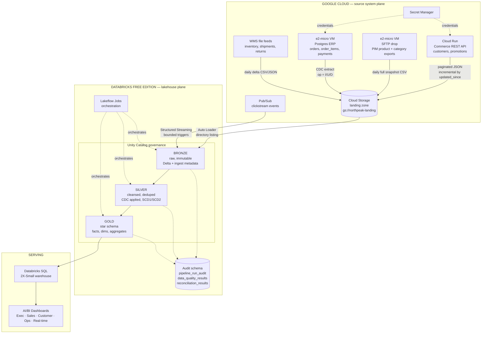
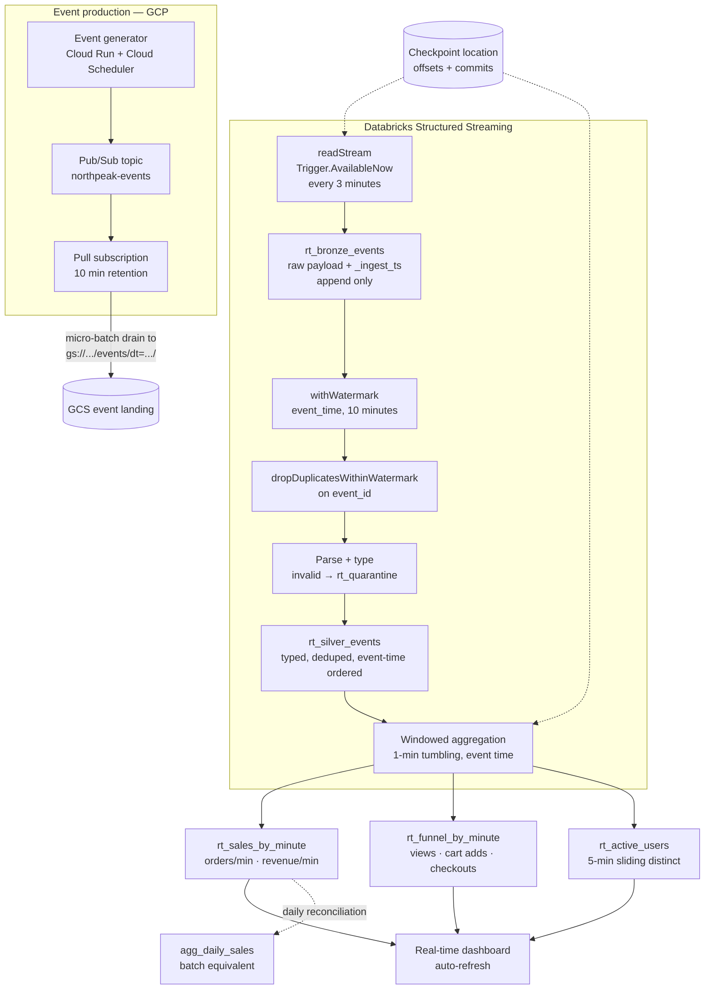
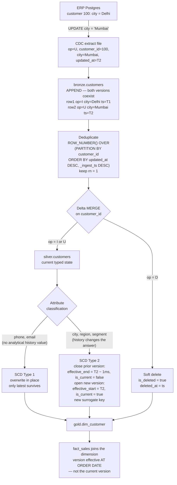
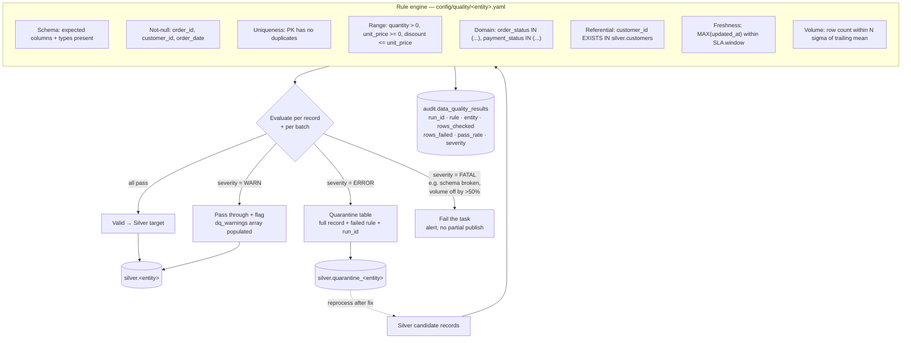
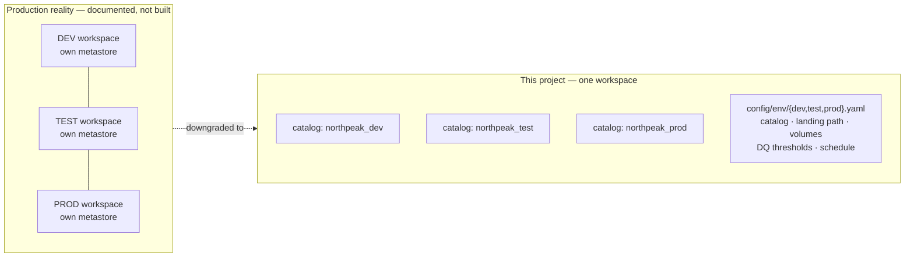

# Architecture

**Project:** Enterprise E-Commerce Lakehouse & Real-Time Analytics Platform
**Phase:** 1 — design only
**Constraints assumed:** see [`PHASE0-FEASIBILITY.md`](PHASE0-FEASIBILITY.md). Databricks Free
Edition (serverless, single workspace, no GCP Organization available), plus a personal GCP project
on the $300 / 90-day trial and Always Free tier.

---

## 1. Architecture at a glance

Five source systems in Google Cloud feed a Databricks lakehouse. Batch and streaming paths
converge on a single conformed Gold star schema. Unity Catalog governs everything.

> **`[VERIFY]`** The `GCS → Bronze` edge depends on Spike 1 (Unity Catalog storage credential for
> GCS on Free Edition). If it fails, that edge becomes `GCS → Databricks Files API → UC Volume →
> Bronze` and nothing else in this diagram changes. See `PHASE0-FEASIBILITY.md` §7.

---

## 2. Medallion layers — responsibility contract

Each layer has exactly one job. The most common failure in real lakehouses is layer bleed:
business logic in Bronze, or raw cleanup deferred to Gold.

```mermaid
flowchart LR
    subgraph B["BRONZE — 'what the source said'"]
        B1["Raw fidelity preserved"]
        B2["Append-only, never updated"]
        B3["+ _ingest_ts, _source_system,<br/>_batch_id, _file_name,<br/>_record_hash, _raw_payload"]
        B4["Schema evolution allowed"]
        B5["NO business logic"]
    end
    subgraph S["SILVER — 'what is true'"]
        S1["Typed + standardised"]
        S2["Deduplicated"]
        S3["DQ applied, invalid quarantined"]
        S4["CDC merged: I/U/D"]
        S5["SCD1 + SCD2 history"]
        S6["Referential integrity enforced"]
    end
    subgraph G["GOLD — 'what the business asks'"]
        G1["Conformed star schema"]
        G2["Surrogate keys resolved"]
        G3["Metric definitions applied once"]
        G4["Aggregates + real-time marts"]
    end
    B --> S --> G
```

| Rule | Bronze | Silver | Gold |
|---|---|---|---|
| Can rows be modified? | Never — append only | Yes (MERGE) | Yes (rebuild or MERGE) |
| Can a source record be dropped? | Never | Yes → quarantine | N/A |
| Business rules applied? | No | Validation rules only | Metric definitions |
| Can it be rebuilt from the layer above? | From source files | From Bronze | From Silver |
| Who can read it? | Engineers only | Engineers + analysts (masked) | Everyone |

**Why Bronze exists at all** — the single most common interview question on medallion. Three
reasons, in order of importance: (1) **replay** — source systems overwrite and purge; Bronze is
the only place the original bytes survive, so any Silver logic bug is recoverable without going
back to the source; (2) **decoupling** — ingestion frequency and transformation frequency become
independent; (3) **audit** — reconciliation needs an untouched count to compare against.

---

## 3. Batch pipeline

```mermaid
flowchart TB
    START(["Job trigger — daily 04:00 UTC"]) --> CFG

    CFG["Read entity config<br/>config/entities/*.yaml"] --> LOOP

    subgraph LOOP["Config-driven ingestion framework — one engine, N entities"]
        direction TB
        L1["Resolve load pattern<br/>full | incremental | cdc"] --> L2
        L2["Auto Loader readStream<br/>cloudFiles + schemaLocation<br/>+ checkpointLocation"] --> L3
        L3["Attach ingest metadata<br/>_batch_id _ingest_ts _file_name<br/>_source_system _record_hash"] --> L4
        L4["Append to Bronze Delta<br/>Trigger.AvailableNow"]
    end

    LOOP --> BV["Bronze validation<br/>row count &gt; 0, schema present,<br/>file manifest recorded"]
    BV --> DQ1

    subgraph SILVERSTAGE["Silver transformation"]
        direction TB
        DQ1["Standardise types + nulls<br/>trim, casefold, canonical codes"] --> DQ2
        DQ2["Deduplicate<br/>window by PK, order by updated_at desc"] --> DQ3
        DQ3["Data quality rules<br/>from config/quality/*.yaml"] --> SPLIT
        SPLIT{"Rule severity"}
        SPLIT -->|pass| APPLY
        SPLIT -->|"warn"| APPLY
        SPLIT -->|"fail"| QUAR["Quarantine table<br/>+ data_quality_results"]
        APPLY["Apply CDC<br/>Delta MERGE on PK<br/>I → insert, U → update, D → soft delete"] --> SCD
        SCD["Dimension history<br/>SCD1 overwrite | SCD2 close + open"]
    end

    SCD --> RI["Referential integrity check<br/>orphan facts → inferred dim members"]
    RI --> GOLDSTAGE

    subgraph GOLDSTAGE["Gold build"]
        direction TB
        G1["Rebuild / merge dimensions<br/>assign surrogate keys"] --> G2
        G2["Build facts<br/>resolve SKs as-of event date"] --> G3
        G3["Refresh aggregates"]
    end

    GOLDSTAGE --> REC["Reconciliation<br/>source vs Bronze vs Silver vs Gold<br/>counts + monetary sums + hashes"]
    REC --> OPT["OPTIMIZE + VACUUM<br/>liquid clustering maintenance"]
    OPT --> REFRESH["Refresh DBSQL dashboards"]
    REFRESH --> AUDITW["Write pipeline_run_audit"]
    AUDITW --> END(["Done"])

    QUAR -.->|"does not fail the run"| RI
```

**Concurrency note:** Free Edition allows **5 concurrent job tasks**. The ingestion loop fans out
to at most 4 parallel entity tasks; everything downstream is sequential. This is a constraint, but
it also happens to be sound design — Silver CDC on shared dimensions should not run concurrently
with the facts that reference them.

---

## 4. Streaming pipeline

> **SIMULATED — Kafka.** Free Edition restricts outbound internet to an allow-list, so an external
> Kafka broker is very unlikely to be reachable. Pub/Sub drains to GCS and Auto Loader reads it as
> a stream. The semantics being demonstrated — event time, watermarking, deduplication within
> watermark, windowed aggregation, checkpoint recovery — are **identical to Kafka**; only the
> source connector differs. `STREAMING.md` will carry the production `readStream.format("kafka")`
> configuration, including `startingOffsets`, `maxOffsetsPerTrigger` and `failOnDataLoss`, with an
> explanation of what changes and what does not.

> **Bounded triggers, not continuous.** `Trigger.AvailableNow` fires, drains everything available,
> and stops. A continuously running stream would exhaust the Free Edition daily quota and suspend
> the workspace. This is a real constraint, but note it is also what many production teams choose
> for cost reasons at sub-minute-SLA workloads — worth saying in an interview.

---

## 5. CDC and SCD flow

**The point of SCD2, stated for interviews:** an order placed in January while the customer lived
in Delhi must *stay* attributed to Delhi forever. Joining facts to the *current* dimension row
silently restates history every time somebody moves — and it is invisible, because the report
still runs. That is why `fact_sales` carries `customer_sk` (the version key resolved at order
date), not `customer_id`.

---

## 6. Data quality flow

**Three severities, deliberately.** Failing an entire load because 12 rows out of 400,000 have a
null phone number is how pipelines get bypassed by frustrated humans. Failing *nothing* is how bad
data reaches the CFO. `WARN` / `ERROR` / `FATAL` maps to: *record it*, *quarantine the record*,
*stop the run*. The severity is per-rule, in config, and reviewable.

---

## 7. Technology decisions

Each decision states the alternatives, the choice, and the trade-off accepted.

### ADR-01 — Lakehouse on Databricks rather than BigQuery-only

| | |
|---|---|
| **Options** | (A) BigQuery only. (B) GCS + Dataproc Spark + BigQuery serving. (C) Databricks lakehouse on Delta. |
| **Chosen** | **C** |
| **Why** | The project's purpose is to demonstrate Databricks. But the *architecturally* honest reason: this workload has heavy row-level mutation (CDC MERGE, SCD2 version closing), streaming with event-time semantics, and a requirement for open-format storage readable by multiple engines. Delta on object storage handles all three with one storage layer. |
| **Trade-off** | BigQuery would be cheaper and simpler for pure SQL analytics at this volume, and its serverless model removes all compute tuning. **This is a real point against the chosen design and the honest answer to "why not BigQuery only?"** — BigQuery loses on: open storage format, PySpark-native transformation, and unified batch/streaming code. It wins on operational simplicity. |
| **Interview trap** | Do not claim BigQuery "can't do CDC" — it can, via MERGE. The distinction is storage openness and the unified batch/stream programming model, not raw capability. |

### ADR-02 — Delta Lake rather than Iceberg or Hudi

| | |
|---|---|
| **Options** | Delta Lake, Apache Iceberg, Apache Hudi |
| **Chosen** | **Delta Lake** |
| **Why** | Native to Databricks: Change Data Feed, liquid clustering, `MERGE` optimisations, deletion vectors and Unity Catalog integration all assume Delta. Choosing Iceberg here means fighting the platform. |
| **Trade-off** | Iceberg has broader multi-engine adoption and a cleaner catalog abstraction. On GCP specifically, BigQuery's external-table support for Iceberg is more mature than for Delta. Since you already know Iceberg, `ARCHITECTURE.md` should carry the comparison rather than pretend Delta is universally superior. |
| **Where the Iceberg↔Delta analogy breaks** | See §8. |

### ADR-03 — Config-driven ingestion framework rather than per-entity notebooks

| | |
|---|---|
| **Options** | (A) One notebook per entity. (B) Shared utility functions, per-entity scripts. (C) Metadata-driven engine reading YAML/config tables. |
| **Chosen** | **C** |
| **Why** | 11 entities × 3 layers = 33 near-identical scripts under option A. Adding entity 12 should be a config file, not a code change. This is the single highest-signal senior-engineering artefact in the project. |
| **Trade-off** | Higher upfront cost and a real risk of over-abstraction — a framework that handles every conceivable case becomes unreadable. Mitigation: the config schema is fixed and small (source, target, load_type, pk, watermark_column, partition_column, format, schema_path, dq_rules, active), and genuinely exceptional entities are allowed to opt out with a bespoke module. **"When did you *not* use the framework?" is a question worth being able to answer.** |

### ADR-04 — Auto Loader rather than custom file tracking

| | |
|---|---|
| **Options** | (A) List the directory and compare to a processed-files table. (B) Move files after processing. (C) Auto Loader `cloudFiles`. |
| **Chosen** | **C**, in directory-listing mode |
| **Why** | Auto Loader maintains its own scalable file-state store with RocksDB, gives exactly-once file processing, schema inference with an evolution mode, a rescued-data column for malformed fields, and checkpoint-based recovery. Options A and B are re-implementations that will be worse. |
| **Trade-off** | File-notification mode (Pub/Sub) scales better on very large directories but needs UC service credentials, DBR 16.2+ and Pub/Sub setup — out of practical reach on Free Edition. Directory listing degrades on directories with millions of files; mitigated by date-partitioned landing paths. Documented, not hidden. |

### ADR-05 — Lakeflow Jobs rather than Cloud Composer / Airflow

| | |
|---|---|
| **Options** | (A) Cloud Composer (managed Airflow). (B) Self-hosted Airflow on `e2-micro`. (C) Lakeflow Jobs. |
| **Chosen** | **C** |
| **Why** | Cloud Composer has **no free tier**; its smallest environment runs on the order of $100–300/month depending on sizing — an immediate disqualification here (see `COST.md`). Lakeflow Jobs is included, natively aware of Databricks compute and lineage, and supports task dependencies, retries, parameters and alerting. |
| **Trade-off** | Airflow is far more general — it orchestrates *across* systems, has a richer operator ecosystem, and is more portable between employers. Lakeflow Jobs is excellent inside Databricks and weak outside it. In a real enterprise with non-Databricks steps, Airflow calling Databricks jobs is the common and correct pattern. Say this in interviews; "we use Databricks Jobs so we don't need Airflow" is a weak answer. |

### ADR-06 — Star schema rather than One Big Table or Data Vault

| | |
|---|---|
| **Options** | (A) Kimball star schema. (B) One Big Table / wide denormalised. (C) Data Vault 2.0. |
| **Chosen** | **A** |
| **Why** | Thirteen business questions across shared dimensions is precisely the case dimensional modelling was designed for. Conformed dimensions guarantee that "revenue by region" means the same thing in every dashboard. SCD2 is a first-class concept. |
| **Trade-off** | OBT is faster to query on columnar engines and simpler for a single consumer — but it duplicates dimension logic per table and makes a definition change a rewrite of everything. Data Vault handles multi-source integration and auditability better, at a large complexity cost and with a serving layer still required on top. At 11 entities and one consuming org, Data Vault is over-engineering. |

### ADR-07 — Terraform for platform, Asset Bundles for project

| | |
|---|---|
| **Options** | (A) Terraform for everything. (B) DABs for everything. (C) Split. |
| **Chosen** | **C** — Terraform owns Unity Catalog objects and grants; DABs owns jobs, pipelines and code deployment. |
| **Why** | Terraform is a good fit for slow-moving, stateful governance objects. DABs is purpose-built for the fast-moving project assets and is the Databricks-recommended 2026 path. Mixing them on the same resource causes state fights. |
| **Trade-off** | Two tools, two mental models. Also note Databricks is migrating DABs to a **Direct Deployment Engine** and deprecating its internal Terraform engine through 2026 — the split above is unaffected, but pin CLI versions. On Free Edition, Terraform is **workspace-scoped only**; account-level resources are written as reference code and never applied. |

### ADR-08 — Pub/Sub rather than Kafka

Forced by Free Edition's outbound allow-list. See §4 and `STREAMING.md`. Production design
documented; semantics preserved.

### ADR-09 — Deterministic hash surrogate keys rather than identity columns

| | |
|---|---|
| **Options** | (A) Delta `GENERATED ALWAYS AS IDENTITY`. (B) Deterministic hash of business key + version start. (C) No surrogate key; range join on effective dates. |
| **Chosen** | **B** — `xxhash64(concat_ws('|', business_key, effective_start_ts))` as `BIGINT` |
| **Why** | NFR-IDEM requires that a full historical rebuild produce identical output. Identity columns are assigned in write order and will differ on every rebuild, breaking idempotency, breaking downstream comparisons, and making reconciliation across environments impossible. Hash keys are reproducible anywhere with no coordination. |
| **Trade-off** | Hash collisions are possible. At ~2.4 M customers × a few versions each, 64-bit collision probability is on the order of 10⁻⁷ — but "unlikely" is not "handled", so a uniqueness DQ rule on every surrogate key is mandatory, and it is in the rule config. Option C avoids keys entirely but forces expensive range joins on every fact query. |

---

## 8. GCP → Databricks concept mapping — and where it breaks

You know GCP. This table is the fastest route to Databricks fluency, but the *breakage* column
matters more than the equivalence column, both for building correctly and for interviews.

| You know (GCP) | Databricks equivalent | Valid because | **Where it breaks down** |
|---|---|---|---|
| **GCS** | Cloud object storage under Delta | Same object semantics, same immutability, same eventual-consistency-free listing | Databricks adds a transaction log *on top*; you must never modify Delta files with `gsutil` or you corrupt the table. GCS is no longer "just a bucket you can poke at". |
| **Dataproc Spark** | Databricks Spark | Same Spark API, same DataFrame semantics, same shuffle model | Databricks runs a **proprietary runtime** — Photon (vectorised C++ engine), optimised Delta writes, adaptive query execution defaults, and Disk Cache. Performance intuition from open-source Spark on Dataproc will *understate* Databricks. Also: no cluster to size on serverless — the tuning knobs you know (`num-executors`, `executor-memory`) mostly do not exist. |
| **BigQuery** | Databricks SQL | Both are the SQL serving surface for analysts | **This is the weakest analogy in the table.** BigQuery is a fully integrated storage+compute system with its own proprietary columnar format (Capacitor) and slot-based scheduling; you cannot open a BigQuery table with Spark and write to it as files. Databricks SQL is a *query engine over open Delta files* that Spark, and other engines, write directly. BigQuery has no equivalent of "the same table, written by a Spark job and queried by SQL, in an open format on your own bucket". Conversely, DBSQL has no equivalent of BigQuery slots, BI Engine, or true zero-management serverless scaling. |
| **Cloud Composer / Airflow** | Lakeflow Jobs | Both express DAGs with dependencies, retries, schedules | Airflow is a *general* orchestrator with hundreds of operators for external systems; Lakeflow Jobs orchestrates Databricks work almost exclusively. Airflow has richer backfill, sensors, and XCom-style data passing. Do not claim they are equivalent — claim Jobs is sufficient *for a Databricks-only estate*. |
| **Apache Iceberg** | Delta Lake | Both are open table formats over Parquet giving ACID, time travel, schema evolution, and snapshot isolation | **Metadata architecture differs fundamentally.** Delta uses an ordered JSON transaction log (`_delta_log`) with periodic Parquet checkpoints; Iceberg uses a metadata-file → manifest-list → manifest tree. Consequences: Iceberg has true **hidden partitioning** and partition evolution — Delta does not, it has generated columns and liquid clustering instead. Iceberg's catalog is pluggable and central to correctness; Delta's log is self-describing and the catalog is thinner. Delta's **Change Data Feed** is a first-class stored feature; Iceberg equivalents are changelog scans over snapshots. Concurrency control also differs (Delta optimistic on log versions; Iceberg optimistic on metadata pointer swap). |
| **Dataflow / Beam** | Structured Streaming | Both do event-time processing with watermarks and windows | Beam's model is a genuine unified batch/stream abstraction with configurable triggers and accumulation modes; Structured Streaming is **micro-batch** (Continuous Processing exists but is limited). Beam gives finer control over late-data triggering and panes. Structured Streaming's simplicity — it is just a DataFrame — is the trade. |
| **Dataplex / Data Catalog** | Unity Catalog | Both catalogue, tag and describe data assets | Dataplex is largely a *metadata and discovery* layer; enforcement still happens in IAM on the underlying resource. Unity Catalog is the **enforcement point itself** — it issues short-lived credentials, and a query cannot bypass it. That is a materially stronger governance position, and it is why UC also does column masks and row filters natively. |
| **GCP IAM** | UC privileges + workspace ACLs | Both are role/principal based, both support least privilege | IAM is resource-hierarchy-based (org → folder → project → resource) with policy inheritance. UC is securable-hierarchy-based (metastore → catalog → schema → table) with its own inheritance, and it is **separate from** cloud IAM — the cloud IAM grant on the bucket goes to Databricks' service account, not to your users. Two distinct permission systems that must both be right. |
| **Cloud Logging / Monitoring** | System tables + job run history | Both give operational telemetry | System tables are SQL-queryable Delta tables (billing, audit, lineage, query history) — much easier to join with your own audit tables than Cloud Logging sinks. But retention, coverage and availability vary by tier, and **Free Edition's system table access is limited** — hence this project builds its own audit tables rather than relying on them. |
| **dbt on BigQuery** | dbt on Databricks *or* Lakeflow Declarative Pipelines | dbt works on both, unchanged in concept | Lakeflow Declarative Pipelines (ex-DLT) is *not* dbt. It owns execution, stateful incremental processing, streaming tables and data-quality expectations inside the runtime. dbt is a compile-to-SQL templating and testing tool that leaves execution to the warehouse. They overlap on "declarative transformations with tests" and diverge everywhere else. |

---

## 9. Environment strategy

Real separation means separate workspaces and metastores. Free Edition gives one of each.

| Concern | This project | Production |
|---|---|---|
| Isolation | Catalog per environment | Workspace + metastore per environment |
| Config | `config/env/<env>.yaml`, `--env` job parameter | Same pattern, plus workspace-level bindings |
| Secrets | GCP Secret Manager, per-environment secret names | Same, plus separate GCP projects |
| Promotion | `feature/*` → `develop` (dev) → `release/*` (test) → `main` (prod) | Same branching, separate deploy targets |
| Blast radius | Shared compute quota — a dev runaway job can starve prod | Fully isolated |

> **SIMULATED:** the catalog-per-environment pattern is a genuine and common production choice for
> small teams, so this is a *downgrade*, not a fiction. The honest statement in an interview is:
> "single workspace, catalog-isolated environments, because the free tier permits one workspace —
> in production I'd separate at the workspace and metastore level for blast-radius and quota
> isolation."

---

## 10. Non-goals

- Not a general-purpose ingestion product. The framework covers the load patterns this domain
  needs (full, incremental-watermark, CDC), not every pattern that exists.
- Not multi-tenant. One business, one metastore.
- Not tuned for petabyte scale. Design decisions are annotated with what would change at 10 TB/day
  (see `PERFORMANCE.md` in Phase 13), but the built artefact targets ~6 M rows.
- Not a Databricks feature tour. Features appear because a requirement needs them.
