# Data Model

**Phase:** 1 — design only · **Revision:** R2 (batch only, Debezium CDC)
**Satisfies:** all 13 business questions in [`BUSINESS_REQUIREMENTS.md`](BUSINESS_REQUIREMENTS.md) §4

---

## 1. Source systems

Five systems, eleven entities. Grouping entities under real *systems* (rather than eleven
unrelated feeds) is what makes the config-driven framework worth building: each system has its own
delivery mechanism, cadence and failure mode, but one engine handles them all.

| # | Source system | Entities | Transport | Format | Cadence | Load pattern |
|---|---|---|---|---|---|---|
| S1 | **Shopfront Commerce API** — Docker FastAPI | `customers`, `promotions` | REST, paginated, bearer token → GCS | JSON | Hourly | Incremental by `updated_since` watermark |
| S2 | **PIM export** — Docker SFTP server | `products`, `categories` | SFTP → GCS sync | CSV | Daily 02:00 | Full snapshot |
| S3 | **NorthPeak ERP** — Docker Postgres 16 | `orders`, `order_items`, `payments` | **Debezium WAL capture → Kafka → Parquet → GCS** | Parquet | Every 4 h | CDC (`op` = c/r/u/d) |
| S4 | **WMS feeds** — Docker file-gen | `inventory`, `shipments`, `returns` | File drop → GCS | CSV / JSON | Daily 03:00 | Incremental delta |
| S5 | **Clickstream** — Docker file-gen | `events` | Hourly event files → GCS | JSON | Hourly batches | Append (batch) |
| S6 | **Reference seed** (Git) | `stores` | Repo file | CSV | On change | Full snapshot |

All five operational systems run as containers on Docker Desktop, standing in for an on-premise
estate. GCS is the integration boundary between that estate and the lakehouse — see
`ARCHITECTURE.md` §4.

### Source contracts

Field lists are the *contract*. Any deviation is a schema-drift event that the framework must
detect, not crash on.

**S1 · `customers`** — REST, `GET /api/v1/customers?updated_since=&page=`
```
customer_id      STRING   PK, natural key, format CUST-########
first_name       STRING
last_name        STRING
email            STRING   PII
phone            STRING   PII, nullable, inconsistent formatting by design
address_line1    STRING   PII
city             STRING
state            STRING   2-char, ~2% invalid by design
country          STRING   always 'US'
postal_code      STRING   PII
signup_date      DATE
customer_segment STRING   RETAIL | PREMIUM | WHOLESALE | (nulls injected)
updated_at       TIMESTAMP  watermark column
```

**S1 · `promotions`**
```
promotion_id STRING PK · promotion_name STRING · promo_type STRING (PERCENT|FIXED|BOGO|FREESHIP)
discount_value DECIMAL(10,2) · start_date DATE · end_date DATE · channel STRING · updated_at TIMESTAMP
```

**S2 · `products`** — daily full CSV snapshot
```
product_id   STRING   PK, SKU-######
product_name STRING
category_id  STRING   FK → categories
brand        STRING
price        DECIMAL(10,2)   list price; negative values injected as invalid
cost         DECIMAL(10,2)   PII-adjacent: commercially sensitive
supplier     STRING
status       STRING   ACTIVE | DISCONTINUED | PENDING
updated_at   TIMESTAMP
```

**S2 · `categories`** — `category_id` PK, `category_name`, `parent_category_id`, `department`, `updated_at`

**S3 · `orders`** — Debezium change events

Debezium wraps every row in an envelope. Bronze stores the envelope as delivered; Silver unwraps it.

```
ENVELOPE (as landed)
  op            STRING     c=create · r=snapshot read · u=update · d=delete
  ts_ms         BIGINT     Debezium capture time
  before        STRUCT     row image prior to change (null on c/r)
  after         STRUCT     row image after change (null on d)
  source        STRUCT     { db, schema, table, lsn, txId, ts_ms, snapshot }

PAYLOAD (after.* — unwrapped in Silver)
order_id      STRING     PK, ORD-#########
customer_id   STRING     FK → customers
order_date    TIMESTAMP  business event time
order_status  STRING     PLACED|CONFIRMED|SHIPPED|DELIVERED|CANCELLED|RETURNED
payment_status STRING    PENDING|AUTHORIZED|CAPTURED|FAILED|REFUNDED
shipping_status STRING   NOT_SHIPPED|PICKING|IN_TRANSIT|DELIVERED
store_id      STRING     FK → stores (fulfilment location)
region        STRING     WEST|MIDWEST|SOUTH|NORTHEAST
promotion_id  STRING     FK → promotions, nullable
currency      STRING     always 'USD'
updated_at    TIMESTAMP  application timestamp — NOT the ordering key
```

> **Order by `source.lsn`, not `updated_at`.** The log sequence number is Postgres's own total
> order over commits. Application timestamps suffer clock skew, share values across bulk updates,
> and go stale on backfills. This is the single most important correctness detail in the CDC path.

> A **tombstone** (null-valued message keyed on the primary key) follows every `op=d`. The sink
> preserves it; Silver treats the pair as one logical delete.

**S3 · `order_items`** — CDC
```
op · op_ts · order_id (FK) · order_line_number INT · product_id (FK)
quantity INT · unit_price DECIMAL(10,2) · discount_amount DECIMAL(10,2) · tax_amount DECIMAL(10,2)
updated_at TIMESTAMP
PK = (order_id, order_line_number)
```

**S3 · `payments`** — `payment_id` PK, `order_id` FK, `payment_method`, `payment_amount`,
`payment_status`, `attempt_number`, `paid_at`, `op`, `op_ts`, `updated_at`

**S4 · `inventory`** — daily delta, `snapshot_date` + `product_id` + `location_id` PK,
`quantity_on_hand`, `quantity_reserved`, `quantity_available`, `reorder_point`, `updated_at`

**S4 · `shipments`** — `shipment_id` PK, `order_id` FK, `carrier`, `tracking_number`,
`shipped_at`, `delivered_at`, `ship_from_location`, `updated_at`

**S4 · `returns`** — `return_id` PK, `order_id` FK, `product_id` FK, `return_reason`
(DAMAGED|WRONG_ITEM|NOT_AS_DESCRIBED|CHANGED_MIND|SIZE_ISSUE), `quantity`, `return_date`,
`refund_amount`, `updated_at`

**S5 · `events`** — hourly clickstream JSON files written by `file-gen`
```
event_id     STRING    idempotency key; duplicates injected deliberately
event_type   STRING    product_view|cart_add|cart_remove|checkout_started|
                       order_created|payment_completed|shipment_created
event_time   TIMESTAMP event time — out-of-order and late arrivals injected
ingest_time  TIMESTAMP processing time
session_id   STRING
customer_id  STRING    nullable (anonymous sessions)
product_id   STRING    nullable
order_id     STRING    nullable
channel      STRING    WEB|MOBILE_APP|MARKETPLACE
device_type  STRING
properties   MAP<STRING,STRING>  free-form; the schema-evolution vector
```

**S6 · `stores`** — `store_id` PK, `store_name`, `store_type` (DC|RETAIL|POPUP), `city`,
`state`, `region`, `opened_date`, `is_active`

### Deliberately injected data-quality defects

The generator must produce these so the pipeline has something real to catch:

| Defect | Where | Purpose |
|---|---|---|
| Exact duplicate records | all file sources | Dedup logic |
| Duplicate `event_id` | events | Batch dedup by window function |
| Nulls in required fields | orders, order_items | Not-null rules |
| Negative `quantity`, `unit_price` | order_items | Range rules |
| `discount_amount > unit_price × quantity` | order_items | Cross-field rules |
| Invalid `state` codes | customers | Domain rules |
| Orphan `customer_id` in orders | orders | Referential integrity + inferred members |
| Out-of-order `event_time` | events | Event-time ordering |
| Events arriving in a later hourly file than their `event_time` | events | Late-arriving batch record handling |
| Records late by 2–7 days | orders CDC | Late-arriving fact handling |
| A new column appearing mid-stream | products, events | Schema evolution |
| A column *disappearing* | inventory | Schema evolution, harder case |
| Truncated / malformed file | any | Rescued data + quarantine |
| Same file delivered twice | any | Auto Loader idempotency |
| Hard deletes | orders, customers | CDC delete propagation |

---

## 2. Silver layer

One cleansed table per source entity, plus quarantine siblings. Naming: `silver.<entity>`,
`silver.quarantine_<entity>`.

Silver **is not** the star schema. It is the trusted, deduplicated, type-correct, history-bearing
representation of each source entity. Gold reshapes it for consumption.

| Silver table | Keyed by | History | Notes |
|---|---|---|---|
| `silver.customers` | `customer_id` | SCD2 on `city`, `state`, `region`, `customer_segment` | SCD1 on `phone`, `email`, `address_line1` |
| `silver.products` | `product_id` | SCD2 on `price`, `category_id`, `status` | SCD1 on `product_name`, `brand`, `supplier` |
| `silver.stores` | `store_id` | SCD2 on `region`, `is_active` | |
| `silver.categories` | `category_id` | SCD1 | Low churn, no analytical value in history |
| `silver.promotions` | `promotion_id` | SCD1 | Dates are attributes, not versions |
| `silver.orders` | `order_id` | Current state + soft delete | CDC MERGE target |
| `silver.order_items` | `(order_id, order_line_number)` | Current state | CDC MERGE target |
| `silver.payments` | `payment_id` | Current state | |
| `silver.inventory` | `(snapshot_date, product_id, location_id)` | Append, immutable per day | |
| `silver.shipments` | `shipment_id` | Current state | |
| `silver.returns` | `return_id` | Current state | |
| `silver.events` | `event_id` | Append, deduped | Batch append target |

**Why SCD2 sits in Silver, not only Gold:** history is a property of the *entity*, not of a
reporting shape. Building it once in Silver means Gold dimensions and any future consumer share
one version of the truth. The alternative — Gold-only SCD2 — forces every new mart to rebuild
history logic.

---

## 3. Gold star schema

```mermaid
erDiagram
    DIM_DATE ||--o{ FACT_SALES : "order_date_sk"
    DIM_CUSTOMER ||--o{ FACT_SALES : "customer_sk"
    DIM_PRODUCT ||--o{ FACT_SALES : "product_sk"
    DIM_CATEGORY ||--o{ FACT_SALES : "category_sk"
    DIM_STORE ||--o{ FACT_SALES : "store_sk"
    DIM_PROMOTION ||--o{ FACT_SALES : "promotion_sk"

    DIM_DATE ||--o{ FACT_ORDER_FULFILLMENT : "order_date_sk"
    DIM_CUSTOMER ||--o{ FACT_ORDER_FULFILLMENT : "customer_sk"
    DIM_STORE ||--o{ FACT_ORDER_FULFILLMENT : "store_sk"

    DIM_DATE ||--o{ FACT_RETURNS : "return_date_sk"
    DIM_PRODUCT ||--o{ FACT_RETURNS : "product_sk"
    DIM_CUSTOMER ||--o{ FACT_RETURNS : "customer_sk"

    DIM_DATE ||--o{ FACT_INVENTORY_SNAPSHOT : "snapshot_date_sk"
    DIM_PRODUCT ||--o{ FACT_INVENTORY_SNAPSHOT : "product_sk"
    DIM_STORE ||--o{ FACT_INVENTORY_SNAPSHOT : "store_sk"

    DIM_DATE ||--o{ FACT_CUSTOMER_EVENTS : "event_date_sk"
    DIM_CUSTOMER ||--o{ FACT_CUSTOMER_EVENTS : "customer_sk"
    DIM_PRODUCT ||--o{ FACT_CUSTOMER_EVENTS : "product_sk"

    DIM_DATE ||--o{ FACT_PAYMENT : "payment_date_sk"
    DIM_CUSTOMER ||--o{ FACT_PAYMENT : "customer_sk"

    DIM_CATEGORY ||--o{ DIM_PRODUCT : "category_sk"

    DIM_CUSTOMER {
        bigint customer_sk PK
        string customer_id "natural key"
        string full_name
        string email_masked
        string city
        string state
        string region
        string customer_segment
        date signup_date
        timestamp effective_start_ts
        timestamp effective_end_ts
        boolean is_current
        boolean is_deleted
        string record_hash
    }

    DIM_PRODUCT {
        bigint product_sk PK
        string product_id "natural key"
        bigint category_sk FK
        string product_name
        string brand
        decimal price
        decimal cost
        string supplier
        string status
        timestamp effective_start_ts
        timestamp effective_end_ts
        boolean is_current
    }

    DIM_STORE {
        bigint store_sk PK
        string store_id "natural key"
        string store_name
        string store_type
        string city
        string state
        string region
        boolean is_active
        timestamp effective_start_ts
        timestamp effective_end_ts
        boolean is_current
    }

    DIM_CATEGORY {
        bigint category_sk PK
        string category_id
        string category_name
        string parent_category_name
        string department
    }

    DIM_PROMOTION {
        bigint promotion_sk PK
        string promotion_id
        string promotion_name
        string promo_type
        decimal discount_value
        date start_date
        date end_date
    }

    DIM_DATE {
        int date_sk PK "yyyyMMdd"
        date full_date
        int day_of_week
        string day_name
        int week_of_year
        int month_number
        string month_name
        int quarter
        int year
        boolean is_weekend
        boolean is_holiday
        string fiscal_period
    }

    FACT_SALES {
        bigint sales_sk PK
        string order_id "degenerate"
        int order_line_number "degenerate"
        int order_date_sk FK
        bigint customer_sk FK
        bigint product_sk FK
        bigint category_sk FK
        bigint store_sk FK
        bigint promotion_sk FK
        int quantity
        decimal unit_price
        decimal gross_amount
        decimal discount_amount
        decimal tax_amount
        decimal net_amount
        string order_status
        string payment_status
    }

    FACT_ORDER_FULFILLMENT {
        bigint order_fulfillment_sk PK
        string order_id "degenerate"
        int order_date_sk FK
        bigint customer_sk FK
        bigint store_sk FK
        timestamp placed_at
        timestamp confirmed_at
        timestamp payment_captured_at
        timestamp shipped_at
        timestamp delivered_at
        timestamp cancelled_at
        int hours_to_ship
        int hours_to_deliver
        int order_line_count
        decimal order_net_amount
        string final_status
    }

    FACT_RETURNS {
        bigint return_sk PK
        string return_id "degenerate"
        int return_date_sk FK
        int original_order_date_sk FK
        bigint product_sk FK
        bigint customer_sk FK
        int quantity_returned
        decimal refund_amount
        string return_reason
        int days_to_return
    }

    FACT_INVENTORY_SNAPSHOT {
        bigint inventory_sk PK
        int snapshot_date_sk FK
        bigint product_sk FK
        bigint store_sk FK
        int quantity_on_hand
        int quantity_reserved
        int quantity_available
        int reorder_point
        boolean is_stockout
        boolean is_below_reorder
    }

    FACT_CUSTOMER_EVENTS {
        bigint event_sk PK
        string event_id "degenerate"
        int event_date_sk FK
        bigint customer_sk FK
        bigint product_sk FK
        string session_id "degenerate"
        timestamp event_time
        string event_type
        string channel
        string device_type
    }

    FACT_PAYMENT {
        bigint payment_sk PK
        string payment_id "degenerate"
        int payment_date_sk FK
        bigint customer_sk FK
        string order_id "degenerate"
        string payment_method
        decimal payment_amount
        string payment_status
        int attempt_number
        boolean is_successful
    }
```



### Fact grain — stated explicitly

Grain is the first thing an interviewer will ask and the first thing a bad model gets wrong.

| Fact | Type | **Grain — one row per…** | Additive measures | Semi/non-additive |
|---|---|---|---|---|
| `fact_sales` | Transaction | **one line of one order** | quantity, gross_amount, discount_amount, tax_amount, net_amount | — |
| `fact_order_fulfillment` | **Accumulating snapshot** | **one order** (updated as milestones occur) | order_line_count, order_net_amount | hours_to_ship, hours_to_deliver (averaged, not summed) |
| `fact_returns` | Transaction | **one returned product line of one return** | quantity_returned, refund_amount | days_to_return |
| `fact_inventory_snapshot` | **Periodic snapshot** | **one product × one location × one day** | — | quantity_on_hand / available — **non-additive over time**, additive across products |
| `fact_customer_events` | Transaction | **one event** | event count (implicit) | — |
| `fact_payment` | Transaction | **one payment attempt** | payment_amount | attempt_number |

> **A modelling decision worth defending.** The brief listed both `fact_sales` and
> `fact_order_items`. Building both would create a header fact that is nothing but a `SUM` of its
> lines — a classic redundancy that guarantees the two will eventually disagree. Instead:
> `fact_sales` **is** the atomic order-line fact (order-level revenue is a rollup, always), and
> `fact_order_fulfillment` is an **accumulating snapshot** at order grain carrying the milestone
> timestamps that genuinely cannot be derived from lines. That answers business question 11
> properly and demonstrates a fact type most portfolio projects never touch.

### Non-additive measures — the trap

`quantity_on_hand` must never be summed across dates. Summing 30 daily snapshots of "100 units in
stock" yields 3,000 units that never existed. Correct aggregations are `AVG` over time, or the
value at a specific date. This will be enforced by a semantic view in Gold and stated in the
dashboard, because it is the single most common inventory reporting error.

### Aggregate tables

| Table | Grain | Serves |
|---|---|---|
| `agg_daily_sales` | date × region × category | Q1, Q2, Q3, Q13 |
| `agg_customer_lifetime` | customer | Q5 |
| `agg_customer_cohort` | cohort_month × months_since_signup | Q9 |
| `agg_product_performance` | date × product | Q3, Q6, Q12 |

> **Removed in R2:** the `rt_sales_by_minute`, `rt_funnel_by_minute` and `rt_active_users`
> real-time marts. Scope is batch only; business question 13 is now answered by comparing the
> latest completed day in `agg_daily_sales` against its trailing 28-day trend.

---

## 4. Key strategy

| Key type | Convention | Example |
|---|---|---|
| Natural / business key | Retained on every dimension as `<entity>_id` | `CUST-00012345` |
| Surrogate key | `xxhash64(concat_ws('\|', business_key, effective_start_ts))` → `BIGINT` | `dim_customer.customer_sk` |
| SCD1 dimension SK | `xxhash64(business_key)` — no version component | `dim_category.category_sk` |
| Date key | Integer `yyyyMMdd` — human-readable, sorts naturally, no join to resolve | `20260818` |
| Fact SK | `xxhash64` of the fact's full grain | `fact_sales.sales_sk` from `(order_id, order_line_number)` |
| Degenerate dimension | Business identifier kept on the fact with no dimension table | `order_id`, `session_id`, `return_id`, `payment_id` |

**Why hash keys and not identity columns** — see `ARCHITECTURE.md` ADR-09. Short version:
idempotent full rebuild is a hard non-functional requirement, and identity columns are assigned in
write order, so they differ on every rebuild.

**Collision handling.** 64-bit hash, ~2.4 M customers with a handful of versions each. Collision
probability is negligible but not zero, so a `UNIQUE` data-quality rule runs on every surrogate key
column on every load and fails `FATAL` if violated. Unverified assumptions about hash uniqueness
are how silent data corruption starts.

### Resolving surrogate keys in facts — the as-of join

This is the mechanically important part of SCD2 and the one most implementations get wrong:

```
fact row (order placed 2025-03-14)
   join dim_customer
   on  dim.customer_id = fact.customer_id
   and fact.order_date >= dim.effective_start_ts
   and fact.order_date <  dim.effective_end_ts
```

Not `is_current = true`. Joining on `is_current` attributes every historical order to the
customer's *present* region, silently restating history.

### Late-arriving dimensions (inferred members)

A fact can arrive referencing a dimension member that has not been loaded yet — a real and common
condition, deliberately injected here via orphan `customer_id` values.

Handling: insert an **inferred member** into the dimension with the natural key, all attributes
`UNKNOWN`, `is_inferred = true`, `effective_start_ts` set to the fact's event time. When the real
record arrives, it updates the inferred row in place rather than opening a new SCD2 version. The
fact keeps its surrogate key and never needs restating.

The alternative — routing orphan facts to a `-1` "Unknown" member — loses the linkage permanently
and is only used where the natural key itself is missing or malformed.

---

## 5. Physical design (initial)

Optimisation is Phase 13; these are the starting choices, to be measured and revised.

| Table | Partition / cluster | Rationale |
|---|---|---|
| `bronze.*` | Partition by `_ingest_date` | Enables cheap replay of a specific load window and time-based retention |
| `silver.orders`, `silver.order_items` | Liquid clustering on `(order_date, customer_id)` | Avoids the small-file problem that date partitioning causes at this volume |
| `silver.events` | Partition by `event_date` | High volume, always queried by date |
| `fact_sales` | Liquid clustering on `(order_date_sk, product_sk)` | Both are high-cardinality filter columns; liquid clustering adapts without a rewrite |
| `fact_inventory_snapshot` | Partition by `snapshot_date_sk` | Snapshot semantics — full-partition reads and writes per day |
| `dim_*` | No partitioning | Small; partitioning would only create small files |

> **Do not partition small tables.** ~45 K products partitioned by category produces 12 files of a
> few hundred KB each, and the metadata overhead exceeds any pruning benefit. A dimension under
> roughly 1 GB should be a single unpartitioned Delta table with periodic `OPTIMIZE`.

---

## 6. Question → model traceability

| # | Question | Objects joined |
|---|---|---|
| 1 | Revenue by day/month | `fact_sales` × `dim_date` |
| 2 | Revenue by region | `fact_sales` × `dim_customer` (as-of) × `dim_store` |
| 3 | Revenue by product/category | `fact_sales` × `dim_product` × `dim_category` |
| 4 | AOV | `fact_sales` rolled to `order_id` ÷ distinct orders |
| 5 | CLV | `agg_customer_lifetime` ← `fact_sales` × `dim_customer` |
| 6 | Return rate | `fact_returns` ÷ `fact_sales` on shipment cohort |
| 7 | Inventory availability | `fact_inventory_snapshot` × `dim_product` × `dim_store` |
| 8 | Stockout frequency | `fact_inventory_snapshot` where `is_stockout`, grouped by product |
| 9 | Acquisition / retention | `agg_customer_cohort` ← `fact_sales` × `dim_customer.signup_date` |
| 10 | Conversion rate | `fact_customer_events` sessions ÷ sessions with `order_created` |
| 11 | Fulfilment time | `fact_order_fulfillment.hours_to_ship`, `hours_to_deliver` |
| 12 | Promotion impact | `fact_sales` × `dim_promotion`, promo vs non-promo baseline |
| 13 | Latest day vs trailing trend | `agg_daily_sales` × `dim_date`, 28-day window function |

Every question resolves. No question requires a join path the model does not provide — which is
the actual test of whether a dimensional model is finished.
