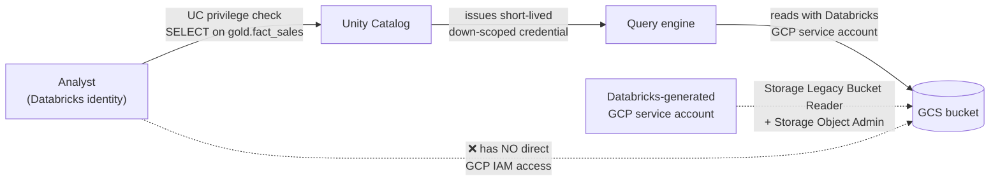

# Security Design

**Phase:** 1 — design only. Implementation is Phase 9.
**Scope note:** all data is synthetic. The controls below are designed as if it were real, because
designing for synthetic data teaches the wrong habits.

---

## 1. PII classification

Every column in the model is classified. Classification drives masking, access and retention.

| Class | Definition | Handling |
|---|---|---|
| **P0 — Direct identifier** | Identifies a person on its own | Masked for all but `pii_reader`; never in Gold unmasked; never in logs |
| **P1 — Indirect identifier** | Identifies in combination with others | Masked in Gold for analysts; available in Silver to engineers |
| **P2 — Sensitive commercial** | Not personal, but commercially confidential | Restricted to Finance and Merchandising roles |
| **P3 — Non-sensitive** | Safe for all authorised users | No restriction |

### Column classification

| Entity | Column | Class | Treatment in Gold |
|---|---|---|---|
| customers | `email` | **P0** | `email_masked` — hash + domain preserved (`a1b2c3…@gmail.com`) for domain analytics |
| customers | `phone` | **P0** | Excluded from Gold entirely; no analytical use case |
| customers | `first_name`, `last_name` | **P0** | Combined into `full_name`, masked to initials for non-privileged roles |
| customers | `address_line1` | **P0** | Excluded from Gold |
| customers | `postal_code` | **P1** | Truncated to first 3 characters |
| customers | `city`, `state`, `region` | **P1** | Retained — required by business question 2 |
| customers | `customer_id` | **P1** | Retained; it is a pseudonymous key, not an identifier |
| customers | `signup_date` | **P1** | Retained |
| customers | `customer_segment` | P3 | Retained |
| products | `cost` | **P2** | Restricted to `finance` and `merch` roles — margin is confidential |
| products | `supplier` | **P2** | Restricted to `merch` |
| events | `session_id` | **P1** | Retained; pseudonymous |
| events | `properties` | **P1** | Free-form map — **must be scanned**, since free-form fields are where PII leaks |
| all | everything else | P3 | Retained |

> **The `properties` map is the real risk.** Free-form key-value fields are how email addresses end
> up in a clickstream table nobody thought contained PII. A DQ rule scans `properties` values
> against email and phone patterns and raises `ERROR` on match. This is the kind of control that
> distinguishes a designed system from a compliant-looking one.

---

## 2. Role model

| Role | Purpose | Bronze | Silver | Gold | Audit |
|---|---|---|---|---|---|
| `platform_admin` | Owns the metastore, catalogs, grants | ALL | ALL | ALL | ALL |
| `data_engineer` | Builds and operates pipelines | SELECT, MODIFY | SELECT, MODIFY | SELECT, MODIFY | SELECT |
| `data_analyst` | Builds reports | ✗ | SELECT (masked) | SELECT (masked) | ✗ |
| `business_user` | Consumes dashboards | ✗ | ✗ | SELECT (masked, curated views only) | ✗ |
| `finance` | Financial reporting | ✗ | ✗ | SELECT + `cost` visible | ✗ |
| `pii_reader` | Support / compliance investigations | ✗ | SELECT (unmasked) | SELECT (unmasked) | SELECT |
| `sp_cicd` | Deployment service principal | MODIFY | MODIFY | MODIFY | MODIFY |
| `sp_pipeline` | Job execution service principal | ALL | ALL | ALL | MODIFY |

**Design rules:**

1. **Analysts never touch Bronze.** Bronze is unvalidated by definition. Granting read on it
   guarantees somebody eventually builds a report from it.
2. **Grants go to groups, never to users.** Individual grants are unauditable within a year.
3. **`pii_reader` is a separate, deliberately awkward role.** Unmasking is an explicit, logged act,
   not a default of seniority.
4. **Service principals for automation, always.** A pipeline running as a person breaks when that
   person leaves — the most common cause of "the pipeline broke and nobody knows why".

> **SIMULATED:** Free Edition has one human identity, so the multi-user model cannot be genuinely
> exercised. It will be implemented as real groups and service principals, and verified by
> querying as a restricted principal. What cannot be shown is genuine concurrent multi-user
> separation.

---

## 3. Masking implementation

Unity Catalog column masks and row filters are applied to the Gold views, not the base tables, so
engineering and audit paths remain unimpeded.

| Mechanism | Applied to | Behaviour |
|---|---|---|
| Column mask | `dim_customer.email_masked` | Returns hashed local part for all roles except `pii_reader` |
| Column mask | `dim_customer.full_name` | Returns initials (`S. T.`) unless `pii_reader` |
| Column mask | `dim_product.cost` | Returns `NULL` unless `finance` or `merch` |
| Row filter | `dim_customer` | Filters `is_deleted = true` rows from analyst-facing views (right-to-erasure simulation) |

Masks are functions registered in Unity Catalog and applied with `ALTER TABLE … SET MASK`, so the
policy lives with the data rather than in every query — which is exactly the property that makes
Unity Catalog an enforcement point rather than a catalogue.

---

## 4. Secrets

**Hard rule: no credential of any kind in the repository.** Enforced by a CI secret-scanning step
that fails the build.

| Secret | Stored in | Consumed by |
|---|---|---|
| Commerce API bearer token | GCP Secret Manager | Cloud Run extractor |
| Postgres connection string | GCP Secret Manager | CDC extract job |
| GCP service account key (if unavoidable) | GCP Secret Manager | — prefer Workload Identity and no key at all |
| Databricks service principal client secret | GitHub Actions encrypted secrets | CI/CD pipeline |
| Databricks PAT (local dev only) | `~/.databrickscfg`, gitignored | Developer machine |

**Rotation:** service principal secrets rotated at project milestones; documented as a 90-day
policy in production.

**What is deliberately *not* used:**
- No `.env` files committed, ever — even with placeholder values, they normalise the pattern
- No secrets in notebook cell output (a real leak vector — output is committed with the notebook)
- No secrets in job parameters (visible in run history)
- No long-lived personal access tokens for automation

> **Notebook output is a genuine leak vector worth naming in interviews.** A `display(df)` on a
> table containing PII, committed to Git, publishes that data permanently. CI strips notebook
> outputs before merge.

---

## 5. Identity and access to cloud storage

Two distinct permission systems must both be correct. This is the part of Databricks-on-cloud
security that most commonly confuses people:

**The key insight:** the analyst has no GCP IAM identity at all. Cloud IAM grants access to
*Databricks' service account*; Unity Catalog decides whether *this user* may use it, and issues a
temporary down-scoped credential per query. A user cannot bypass Unity Catalog to reach the bucket,
because they were never a principal on it.

This is materially stronger than the Dataproc pattern you already know, where a job's service
account often has broad bucket access and per-user control lives outside the data path.

**Least privilege on the GCP side:**
- One bucket, one purpose (landing zone only)
- The Databricks service account is granted on the *bucket*, never at project level
- No `roles/storage.admin` at project scope
- Uniform bucket-level access enabled — ACLs disabled
- Bucket versioning on, with a lifecycle rule deleting non-current versions after 7 days

---

## 6. Environment separation

| Control | Design |
|---|---|
| Catalog isolation | `northpeak_dev`, `_test`, `_prod` — grants differ per catalog |
| Prod write access | Only `sp_pipeline` and `sp_cicd`. **No human has MODIFY on prod.** |
| Dev access | Engineers have full access |
| Secrets | Separate secret names per environment; no shared credential |
| Data | Prod and non-prod both use synthetic data here; in production, non-prod would receive masked or subsetted copies, never a raw prod clone |

"No human has write access to prod" is the single control that prevents the most common serious
incident: someone running an ad-hoc fix against production and destroying history.

---

## 7. Audit

| Requirement | Mechanism |
|---|---|
| Who accessed what | Unity Catalog audit logs |
| What changed in the data | Delta history + Change Data Feed |
| What ran, when, with what result | `audit.pipeline_run_audit` |
| What was rejected and why | `audit.data_quality_results` + quarantine tables |
| What was deployed and by whom | Git history + CI/CD run logs |

Together these answer the four questions an auditor actually asks: who saw it, what changed it,
did it run correctly, and can you prove it.

---

## 8. Threat considerations

| Threat | Mitigation |
|---|---|
| Credential in Git | CI secret scanning; pre-commit hook; no `.env` files |
| PII in a non-PII table | `properties` map scanned by DQ rule; classification reviewed when a source contract changes |
| PII in notebook output | Outputs stripped in CI |
| Over-broad grant | Grants to groups only; grant review documented as a periodic task |
| Data exfiltration via export | Out of scope on Free Edition; production would use egress controls and download restrictions |
| Bad actor with prod write | No human has prod MODIFY |
| Supply chain (dependency) | Pinned dependency versions; `pip-audit` in CI |

---

## 9. What this design does *not* claim

Stated plainly, because overclaiming security is worse than underclaiming it:

- **Not compliance-certified.** No GDPR, SOC 2 or PCI assessment has been performed. Free Edition
  explicitly offers no compliance enforcement.
- **No genuine multi-user testing.** One human identity exists.
- **No network isolation.** Free Edition offers no private networking; production would use
  Private Service Connect and IP access lists.
- **No encryption key management.** Platform-managed encryption only; production would consider
  customer-managed keys.
- **Right to erasure is simulated** via soft delete and row filters. A genuine implementation needs
  hard deletion across Bronze, Silver, Gold and all time-travel history — which conflicts with
  immutable Bronze and is a genuinely hard design problem worth discussing in interviews rather
  than pretending to have solved.
